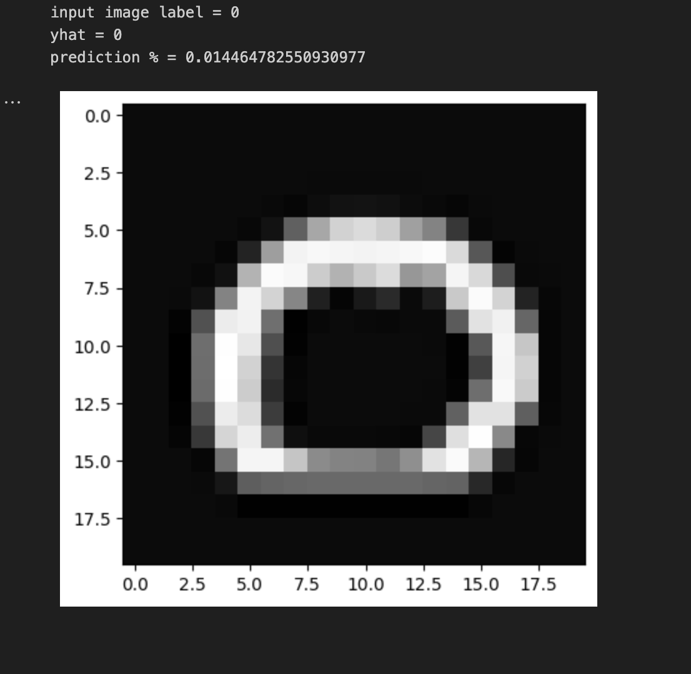

# Neural Network for Handwritten Digit Recognition (Binary Classification)

### Project Overview
- **Objective**: Build a binary neural network in TensorFlow to recognize handwritten digits zero and one.
- **Dataset**: A subset of the MNIST dataset with 1,000 samples of the digits zero and one.
- **Input Representation**:
  - Each digit image is 20x20 pixels, unrolled into a 400-dimensional vector.
  - Data matrix (`X`): 1000 x 400, where each row represents one digit image.
  - Label vector (`y`): Contains binary labels (`0` for zero, `1` for one).
- [Find the implementation code here](./HandwrittenDigitRecognition.ipynb)

### How to Use the Model?
- [Download the trained model from here](https://huggingface.com)
- [Find the inference code here](./Handwritten%20Recognition%20Inference/HandwritingRecognitionInference.ipynb)

### Model Structure
- **Network Architecture**: Three dense layers with sigmoid activation.
- **Training**: Uses Keras Sequential API to define the model, with TensorFlow handling input dimensions.

### Results

Here is an example of the model's prediction:

- **Input Image Label**: 0
- **Predicted Label (yhat)**: 0
- **Prediction Confidence (%)**: 1.45%

This example demonstrates the model's output for a handwritten digit classified as zero, with a prediction confidence of approximately 1.45%. 

*Sample output of the model predicting handwritten digit.*
